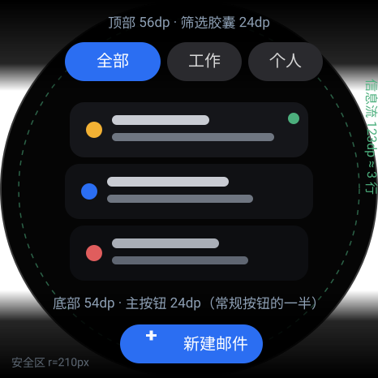

<div align="center">

# 腕邮 WearMail

**为 466 × 466 圆形表盘从零设计的 Wear OS 邮箱客户端**

多账户统一收件箱 · IMAP 收信 · SMTP 发信 · 新邮件通知 · 手机扫码配置 · Outlook OAuth2

-blue)


</div>

---

## 这是什么

一个**完整的、可编译运行的** Wear OS 邮箱客户端：手写 SQLite + JavaMail 收信发信、Android Keystore
加密保管凭据、局域网扫码从手机配置账户、Outlook/Office 365 走 OAuth2 设备码流。

项目不是"能跑就行"的演示：**221 个纯 JVM 单元测试 + 12 项静态检查**全绿，圆屏布局按几何公式推导，
每一处设计取舍与踩过的坑都写在文档里（包括**至今仍未在真机验证的部分**）。

> 技术文档（完整功能清单 / 构建 / 目录结构 / 安全说明 / 已知限制）见 **[docs/TECHNICAL.md](docs/TECHNICAL.md)**。

## 亮点

| | |
|---|---|
| 🧮 **圆屏几何当作数学问题** | 安全半径 210px、逐项按 Y 坐标计算弦长收窄列表项、**纵向预算**被写成静态检查：信息流可视带 < 100dp 或按钮热区 < 48px 会直接让 CI 失败 |
| 📱 **手机扫码配置账户** | 手表起一个一次性 token 的局域网 HTTP 服务并显示二维码 → 手机扫码填表 → 凭据经 Keystore 加密落盘。手表上打字体验太差，这是最省事的路径 |
| 🎛 **按钮只有一半大** | 自绘 24dp 迷你胶囊（= 常规 52dp 按钮的一半，恰好等于 48px 触控下限），把 233dp 表盘的信息流可视带从 65dp 提到 **123dp（约 3 行邮件）** |
| 🔐 **凭据不落明文** | AES-256-GCM + Android Keystore；OAuth2 的 refresh token 同样加密存储；日志门面在**编译期之外**还有静态红线检查 |
| 🧪 **可测性优先** | 几何、HTML 剥离、地址解析、加密、OAuth2 轮询状态机、通知自检全部下沉为纯函数，无需模拟器即可回归 |

## 界面与圆屏适配



> 上图按 [docs/UI_SPEC.md](docs/UI_SPEC.md) 的几何**绘制**（非真机截图）：466×466 圆屏在 density 2.0 下高 233dp，
> 顶部给时间弧线与筛选器、底部给主按钮，**中间剩下的才是信息流**。

| 版本 | 顶部占用 | 底部占用 | 信息流干净可视带 |
|------|--------:|--------:|----------------:|
| 初版 | 88dp | 136dp | 9dp（不到一行邮件） |
| 第二轮（状态信息移入列表尾项 + 紧凑胶囊） | 84dp | 84dp | 65dp（约 1.5 行） |
| **当前（按钮减半为 24dp 迷你件）** | **56dp** | **54dp** | **123dp（约 3 行）** |

布局约束全部来自几何而非手感：例如底部按钮的下沿不能低于 y=211dp，因为再往下圆弧的可用弦长会小于
胶囊宽度，按钮两端会被切掉。

## 功能一览

| 类别 | 说明 |
|------|------|
| 多账户 | Gmail / Outlook / QQ / 163 / 企业邮箱预设，支持自定义 IMAP/SMTP 主机、端口与加密方式 |
| 统一收件箱 | 所有账户按时间倒序合并、账户筛选、下拉刷新、未读标记与来源账户色点 |
| 邮件详情 | 纯文本正文（HTML 已剥离）、发件人/时间/主题、底部回复/删除/已读操作栏 |
| 撰写发送 | 收件人（常用联系人快捷选择）、主题、正文、发件账户选择；失败自动存草稿，联网后补投 |
| 收信 | JavaMail；首次拉 50 封元数据、增量按 UID、IDLE 推送（支持时）、10 秒超时、指数退避重连 |
| 通知 | 「发件人 + 主题前 30 字」，点击直达详情；全局/账户级开关；**内置测试通知与链路自检** |
| Outlook OAuth2 | 设备码流授权（手表显示短码 + 二维码，手机浏览器登录）+ refresh token 自动续期 |
| 缓存 | 元数据 500 封 / 正文 50 封，超出按 LRU 淘汰 |
| 安全 | Android Keystore 加密凭据、`allowBackup=false`、全程 TLS/STARTTLS、日志不写敏感值 |

## 快速开始

### 环境要求

- JDK 17（AGP 8.7 要求）
- Android SDK：`compileSdk 35` / `build-tools 35.0.0`，在 `local.properties` 里配置 `sdk.dir`
- Gradle 8.11.1 由 wrapper 提供（首次构建会联网下载）

### 构建与安装

```bash
./gradlew test                 # 221 个单元测试（纯 JVM，无需设备）
./gradlew assembleDebug        # 调试包
./gradlew assembleRelease      # 发布包（R8 + 资源压缩，约 3.35 MB）
./gradlew installDebug         # 安装到已连接的手表

python tools/static_checks.py  # 12 项静态检查（不需要 Gradle/SDK）
```

Windows 下把 `./gradlew` 换成 `gradlew.bat`。

> **仓库不含签名证书**：`keystore/` 已被 `.gitignore` 排除。克隆后 `assembleDebug` 会自动使用 AGP 的
> 默认调试证书；需要自己的证书时用 `-Pwearmail.storeFile=... -Pwearmail.storePassword=...` 指定。

### 首次配置账户（三选一）

1. **手机扫码（推荐）**：账户管理 → 添加账户 → 用手机扫码配置；手机与手表连同一 Wi-Fi，
   扫码后填邮箱与授权码即可。
2. **手表手动/自动探测**：输入邮箱与授权码 →「自动探测」回填服务器参数 →「验证连接」→ 保存。
3. **Outlook / Office 365**：必须用 OAuth2，见下节。

> 多数服务商需要先在网页端开启 IMAP/SMTP 并生成**应用专用密码/授权码**（QQ、163、Gmail 均如此）。

## 配置 Outlook（OAuth2）

**Releases版本已配置相关ID，如无需自己构建请使用Releases版**

微软已对 Exchange Online / Outlook.com **停用 IMAP/SMTP 基础认证**，所以 Outlook 账户只能走 OAuth2。
本项目已完整实现设备码流与令牌续期，但**客户端 ID 需要你自己注册**（没人能替你注册）：

1. 打开 [Azure 门户 → 应用注册](https://portal.azure.com/#view/Microsoft_AAD_RegisteredApps/ApplicationsListBlade) →「新注册」；
2. 「受支持的账户类型」选**「任何组织目录中的账户和个人 Microsoft 账户」**（个人 outlook.com 也能用）；
3. 「重定向 URI」留空 —— **设备码流不需要**；
4. 进入「身份验证」→ 底部「高级设置」→ **「允许公共客户端流」选「是」**（不开启设备码流会被直接拒绝）；
5. 复制概览页的**「应用程序(客户端) ID」**，填到手表「设置 → Outlook OAuth2」（租户保持 `common`）。

然后在「添加账户」里邮箱填 Outlook 地址、登录方式选 **OAuth2 令牌** →「获取授权」→
手机扫码打开授权页并输入手表显示的短码 → 授权成功后保存。

> 公共客户端 + 设备码流**不需要客户端密码**。权限在授权时动态申请：
> `offline_access`、`https://outlook.office.com/IMAP.AccessAsUser.All`、`https://outlook.office.com/SMTP.Send`。
> 为什么不用"跳浏览器登录"：手表没有可用的浏览器控件，而设备码流正是为输入受限设备设计的。

## 架构速览

```
MainActivity ── HorizontalPager（设置 │ 统一收件箱 │ 账户管理）
                     └── 覆盖层：邮件详情 / 撰写 / 添加账户
core/AppContainer（手写依赖容器，无 Hilt/KSP）
├── data/   crypto（Keystore + AES-GCM）· db（手写 SQLiteOpenHelper + 5 个 DAO）· prefs · repo
├── mail/   ImapClient · SmtpClient · ServerProbe · HtmlTextExtractor · oauth/（设备码流 + 令牌续期）
├── sync/   SyncService / SyncEngine / SyncWorker（单飞 + 离线优先 + 指数退避）
├── notify/ NotificationCenter + 链路自检
├── pairing/ 局域网 HTTP 配置服务 + 二维码
└── ui/     theme · kit（圆屏几何组件）· nav · screen/*
```

四个值得说明的取舍：

1. **不用 Room / Hilt / KSP / navigation-compose**：数量有限时手写更可控，也避免注解处理器拖慢构建、
   增大手表上的方法数。路由用 `HorizontalPager` + 覆盖层状态机。
2. **可测性驱动分层**：凡是能下沉为纯函数的逻辑（几何、解析、状态机）都不碰 Android API，
   这样在没有设备/模拟器的环境里也能有 221 个测试兜底。
3. **不可自动验证的部分写成静态规则**：覆盖层透明度、Keystore 的 IV 约束、信息流纵向预算
   这三类"只在真机暴露"的问题，全部固化成静态检查并验证过规则对缺陷版本会 FAIL。
4. **安全默认值**：凭据只以密文落盘、令牌不进入任何 `data class`（避免 `toString()` 泄露）、
   日志门面 + 静态红线、`allowBackup=false`、扫码服务用一次性 token 且离开页面立即关端口。

## 测试与验证

| 项目 | 结果 |
|------|------|
| 单元测试（纯 JVM，无需设备） | ✅ **221 / 221 通过**（14 个测试类） |
| 静态检查 | ✅ **12 / 12 通过**（`python tools/static_checks.py`） |
| Debug / Release 构建 | ✅ 27.76 MB / **3.35 MB**（R8 + 资源压缩） |
| 真机端到端 | ⚠️ **未验证**（无真机环境，见下） |

**未在真机验证的部分（诚实说明）**：真实 IMAP/SMTP 收发、IMAP IDLE 行为、通知实际弹出、
表冠手感、冷启动耗时、帧率与内存峰值、R8 压缩后的运行行为、Outlook OAuth2 的真实授权往返
（无 Azure 应用与真实账户）。协议与逻辑均有单元测试覆盖，但**真机行为需要你自己确认**；
`docs/TESTING.md` §7 提供了 26 条可执行的手工验收清单，§5.3 记录了 6 个真实缺陷的根因与修复。

## 项目结构

```
app/src/main/java/com/wm/wearmail/
├── core/      AppContainer · Logs · RotaryBus · WearMailApp
├── model/     Account · EmailMeta · Draft · ProviderPresets · OAuthTokens
├── mail/      ImapClient · SmtpClient · ServerProbe · MailError · oauth/
├── data/      crypto/ · db/ · prefs/ · repo/
├── sync/      SyncEngine · SyncService · SyncWorker
├── notify/    NotificationCenter · NotificationDiagnostics
├── pairing/   PairingController · ConfigWebServer · PairingPage · QrCodeRenderer
├── ui/        theme/ · kit/ · nav/ · screen/{inbox,detail,compose,accounts,settings}
└── util/      TimeFormat
app/src/test/  14 个测试类 / 221 个用例
tools/         static_checks.py · test_summary.py · mirrors-init.gradle
docs/          TECHNICAL.md · ARCHITECTURE.md · UI_SPEC.md · TESTING.md
```

## 文档

| 文档 | 内容 |
|------|------|
| [docs/TECHNICAL.md](docs/TECHNICAL.md) | **技术与验证文档**：完整功能清单、构建、目录结构、安全与隐私、已知限制、发布前检查 |
| [docs/ARCHITECTURE.md](docs/ARCHITECTURE.md) | 分层结构、数据库表、同步策略、安全设计、OAuth2 授权与令牌续期、性能取舍、依赖矩阵 |
| [docs/UI_SPEC.md](docs/UI_SPEC.md) | 圆屏坐标系与弦长表、纵向预算、按钮尺寸层级、覆盖层规范、六页布局、手势映射 |
| [docs/TESTING.md](docs/TESTING.md) | 测试策略与覆盖矩阵、静态检查、真实缺陷案例、未验证项、26 条真机验收清单 |

## 已知限制

1. **附件**只做启发式标记（`multipart/mixed`），不下载、不展示内容；
2. **文件夹管理**：IMAP 侧有 `listFolders` 能力，UI 目前只用收件箱；删除优先移到 `\Trash`；
3. **左右滑删除邮件**改为「长按菜单 + 二次确认」，因为该手势与顶层页面切换冲突；
4. **OAuth2 仅实现 Microsoft**。协议层（`FormPoster` + `MicrosoftOAuth`）是提供商无关的，
   加 Google 只需再写一个同形状的类；
5. `release` 构建开启 R8，keep 规则已覆盖 JavaMail 的反射用法，但未做真机回归。

## 许可证

MIT

## 免责声明

本项目为个人独立实现，与 Microsoft、Google 无任何关联；Outlook、Wear OS、Android 等名称与商标
归各自所有者。请自行确认你的邮箱服务商条款允许第三方客户端通过 IMAP/SMTP 访问。
